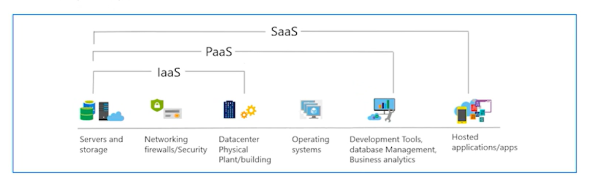
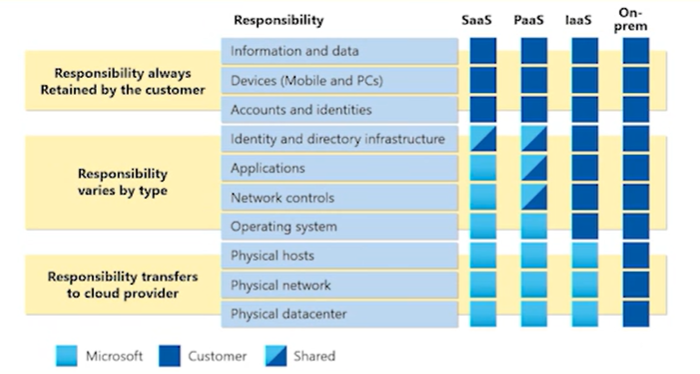

# Day 1 - Azure Learning Plan

## Cloud Fundamentals

### Introduction to Cloud Computing

- Definition and benefits of cloud computing
  A service that is available over the internet, allowing users to access computing resources on-demand.

### Types of Cloud Deployments

- Private Cloud: Cloud infrastructure operated solely for a single organization.

  - Maintaining control over data and security.
  - Customization to meet specific business needs.

- Public Cloud: Cloud services offered over the public internet and available to anyone.

  - Cost-effective and scalable.
  - Managed by third-party providers.
  - Scale without changing underlying infrastructure.
  - can access resources from anywhere with an internet connection.
  - cost saving because cloud services are shared between multiple users.

- Hybrid Cloud: A combination of private and public clouds, allowing data and applications to be shared between them.

  - Flexibility to choose optimal deployment for each workload.
  - Enhanced security for sensitive data.
  - Cost efficiency by leveraging public cloud resources when needed.
  - Cons complexity in management and integration.

### Compare capex and opex in different cloud models.
- Capital Expenditure (CapEx): Upfront costs for physical hardware and infrastructure in traditional IT setups.
- Operational Expenditure (OpEx): Ongoing costs for cloud services, typically billed based on usage, allowing for more predictable budgeting and reduced upfront investment.

**Consumption-based** pricing model: Pay only for the resources you use, allowing for cost efficiency and scalability, better cost prediction, and reduced upfront investment.

### Cloud Service Models

- Types of cloud services: *IaaS*, *PaaS*, *SaaS*
  - IaaS (Infrastructure as a Service): Provides virtualized computing resources over the internet.
  Most flexible
  - PaaS (Platform as a Service): Provides a platform allowing customers to develop, run, and manage applications.
  Focus on application development without worrying about underlying infrastructure.
  - SaaS (Software as a Service): Delivers software applications over the internet, on a subscription basis.
  Pay as you go model, ready to use applications.

  

### Cloud Benifits
- High Availability
- Elasticity
- Scalability
    * vertical scaling - adding more power (CPU, RAM) to an existing machine.
    * horizontal scaling - adding more machines to handle increased load.
- Reliability
- Predicibility
- Security
- Governance - policies and rules to manage cloud resources effectively, production standards, compliance, and cost management.
- Managability

### Related Concepts

- Virtualization: The creation of a virtual version of something, such as a server or storage device.
- Hypervisor: Software that creates and runs virtual machines.
- API: A set of protocols for building and interacting with software applications. Communication between different software intermediaries. Cloud and API are related as APIs enable interaction with Cloud services that are written by Cloud providers.
- Regions: Geographical areas where cloud providers have data centers.
- Availability Zones: Isolated locations within data center regions that provide redundancy and reliability.
- Scalability: The ability to increase or decrease IT resources as needed to meet changing demand.
- Elasticity: The ability to automatically adjust resources based on demand.
- High Availability: Ensuring that cloud services are consistently operational and accessible.
- Disaster Recovery: Strategies and processes for recovering data and applications in the event of a disaster.
- Agility: The ability to quickly adapt to changes and deploy new applications or services.
